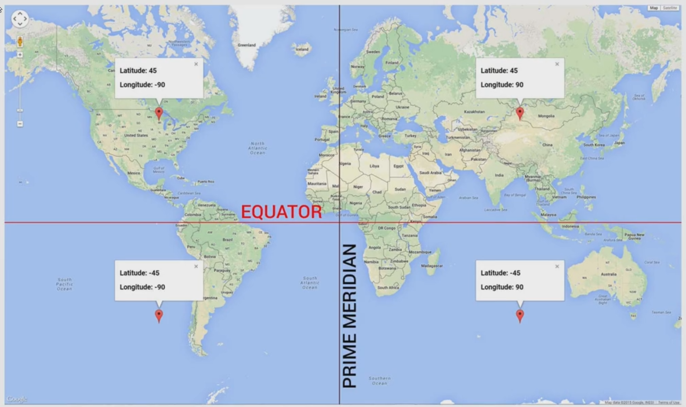

# Introduction

Before you start working with Google Maps, it's helpful to have a quick geography review. At this step we will discuss **latitude and longitude coordinates**, **referencing locations** relative to the equator and prime meridian, and understanding the workings of how it related to Google Maps.

# Latitude & Longitude

In Google Maps, locations are referenced using decimal degree, latitude and longitude coordinates. 

**Latitude lines** run horizontally around the Earth, and provide a north/south position for a particular location.

**Longitude lines** run vertically, and provide an east/west position for a given location.

Using latitude and longitude coordinates along with an **elevation**, you can reference any point on Earth.

# Reference lines

The **equator** is found at zero degrees latitude.

The **prime meridian** found at zero degrees longitude.

Longitude lines extend 360 degrees around the Earth, and are reference from plus 180 degrees to the East of the prime meridian, and minus 180 degrees to the west.

Latitude lines are represented from plus 90 degrees, to the north and minus 90 degrees to the south.

When I plot the Equator and Prime Meridian on a Google map, you'll notice it represents four quadrants that represent a coordinate plane. This plane is what we'll use when referencing latitude and longitude locations. So, if you were referencing a location in Russia, for example, both latitude and longitude will be positive, and if you're in Australia, you have a positive longitude, but a negative latitude.

# Inner working of Google Maps

When referring to latitude and longitude locations in Google Maps, you will need to use decimal degrees. If a location is represented by a north, south, east or west heading, you will need to use that heading to set the sign and location based on the coordinate plane quadrant we've just discussed. Locations can also be represented in degrees, minutes, seconds format, and will need to be converted to decimal degrees before use.

Typically, when you reference a location, you would give someone the street address, however, when you're using the Google Maps API to reference an address on the map, you need to convert it into latitude and longitude coordinates. This process is known as **geocoding**.

When instantiating Google Map, the two required parameters are the **center** (latitude and longitude coordinates) and the **zoom**.

Zoom specifies the resolution of the map, with zero representing a full view of the Earth. As you increment the zoom value, you will zoom in on a particular location. Zoom levels in Google Maps represented from zero to twenty-one. Depending on the availability of imagery in a particular location, there are sometimes more, or less zoom levels present.